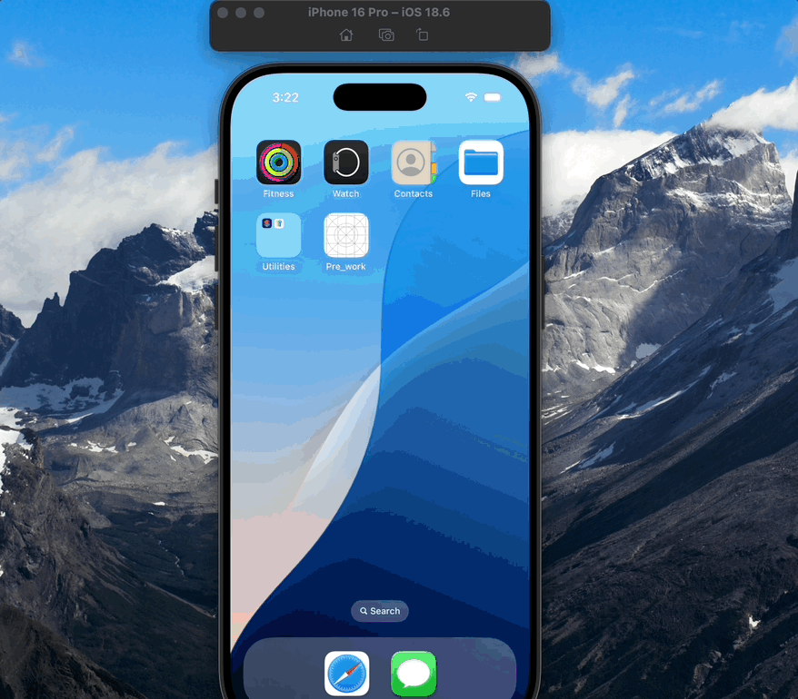

# Prework_app

## App Description
A simple iOS app that allows users to input their personal information, adjust their pet preferences, and introduce themselves interactively.
---

## App Walk-through

---

## Required Features
- [x] App displays an image of a school's logo  
- [x] App has three textfields for first, last, and school names  
- [x] App has a segmented control that changes student year  
- [x] Number of pet matches label is increased/decreased by stepper  
- [x] Switch makes a statement about wanting more pets or not (true/false)  
- [x] Introduce yourself button shows alert box with an introduction and dismiss button  

---

## Optional Features
- [ ] User can tap a button to change the color of the background view  
- [ ] User can select additional buttons that provide more info about the user (e.g., more textfields, a different alert box, etc.)  
- [ ] Any stylistic changes that are not default options (document them here)  

---

## Notes
- The stepper is both an **Outlet** (for accessing its value) and an **Action** (triggering updates when pressed).  
- The "Introduce Self" button currently shows an alert, but it can be extended to segue into a new screen with more detailed info.  
